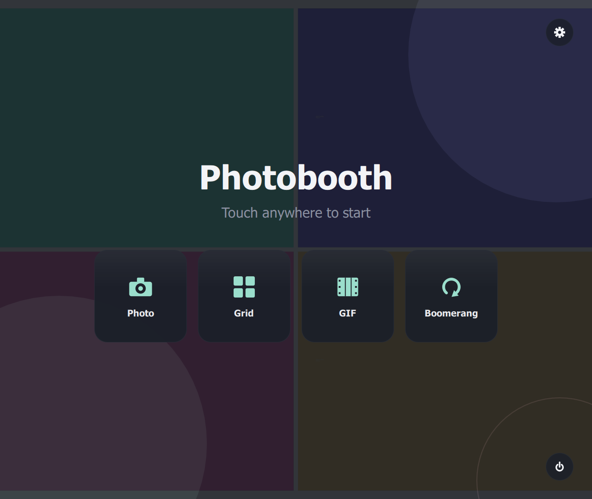
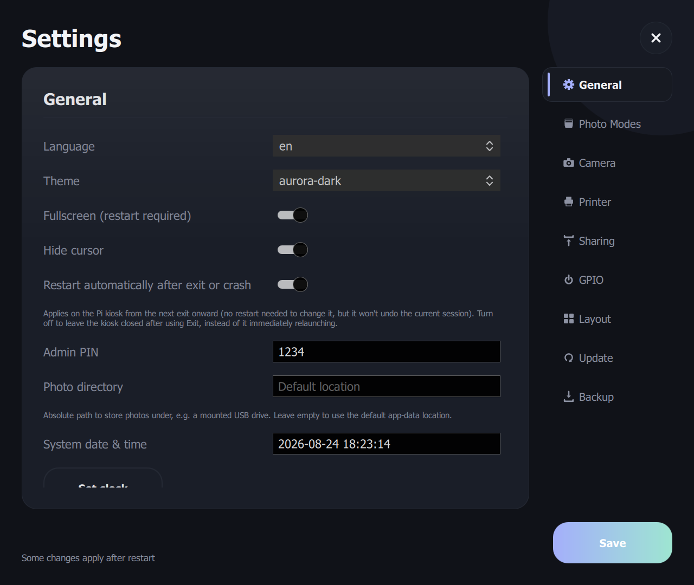
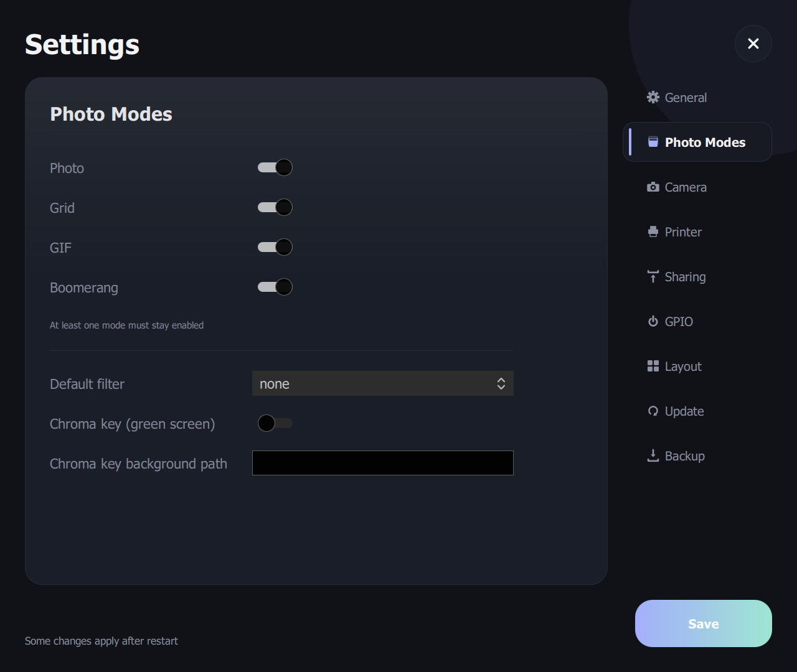
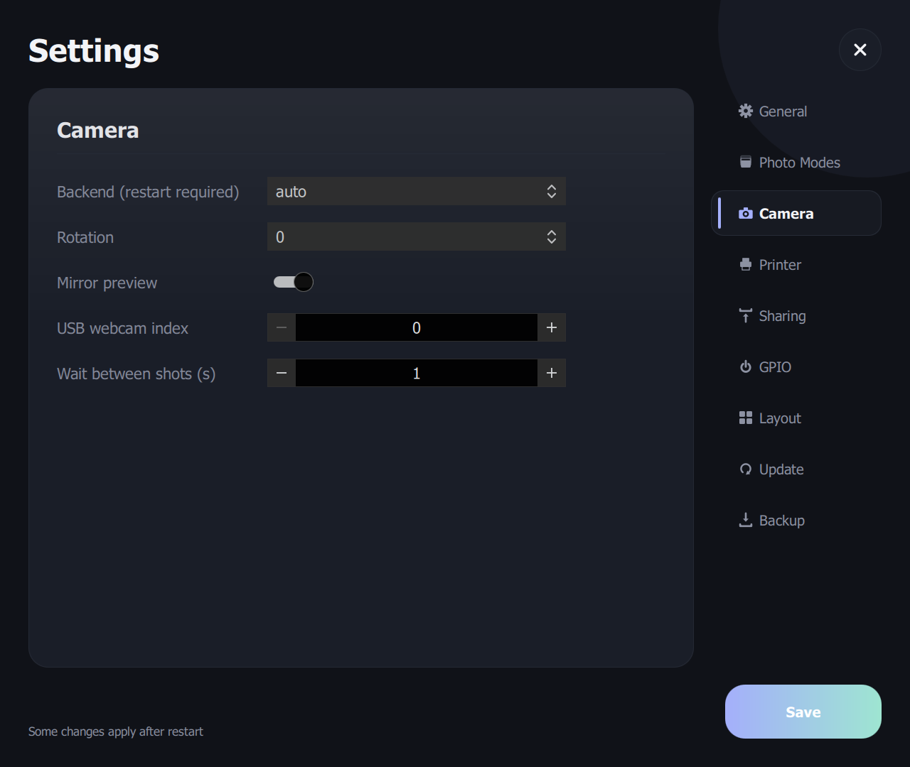
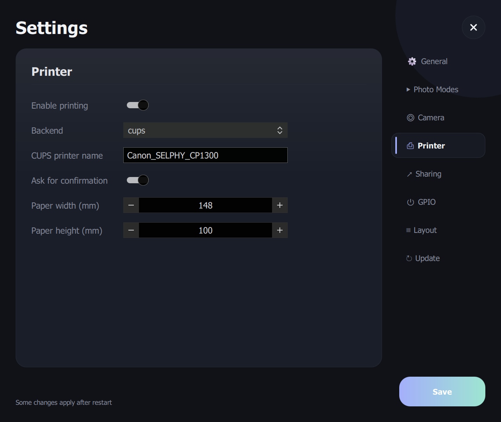
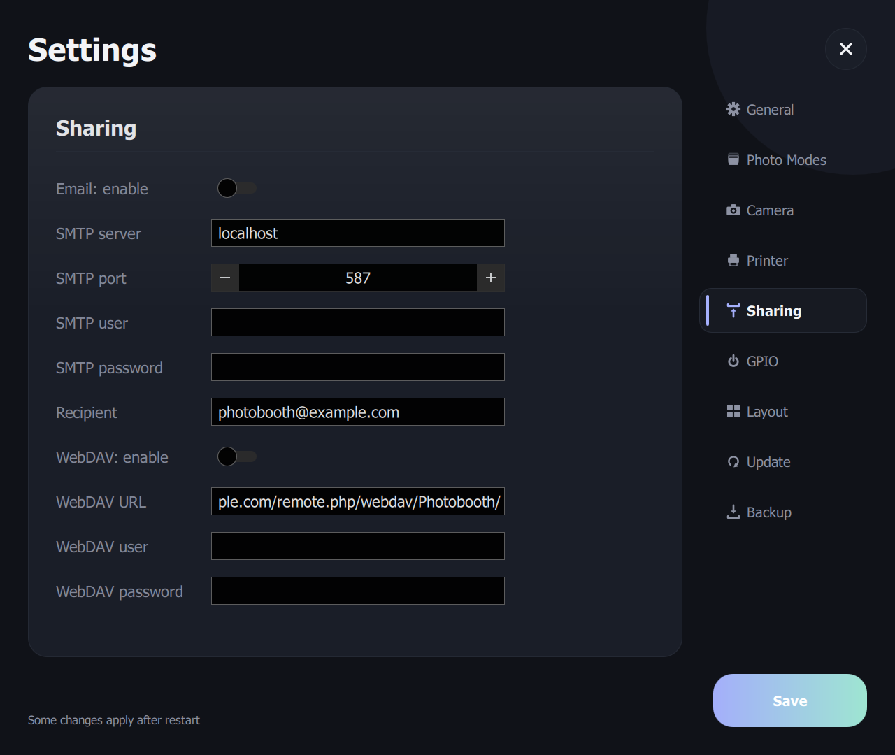
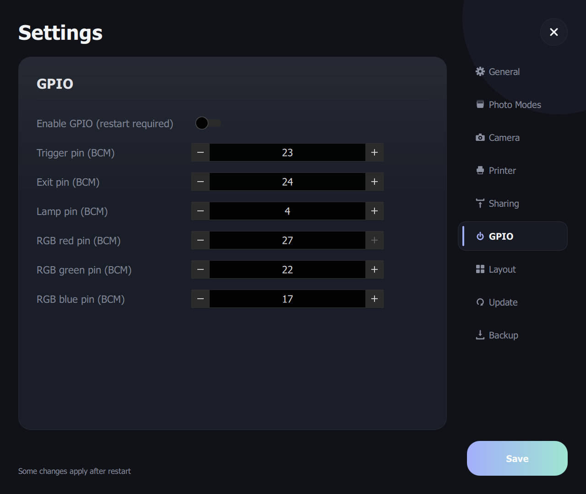
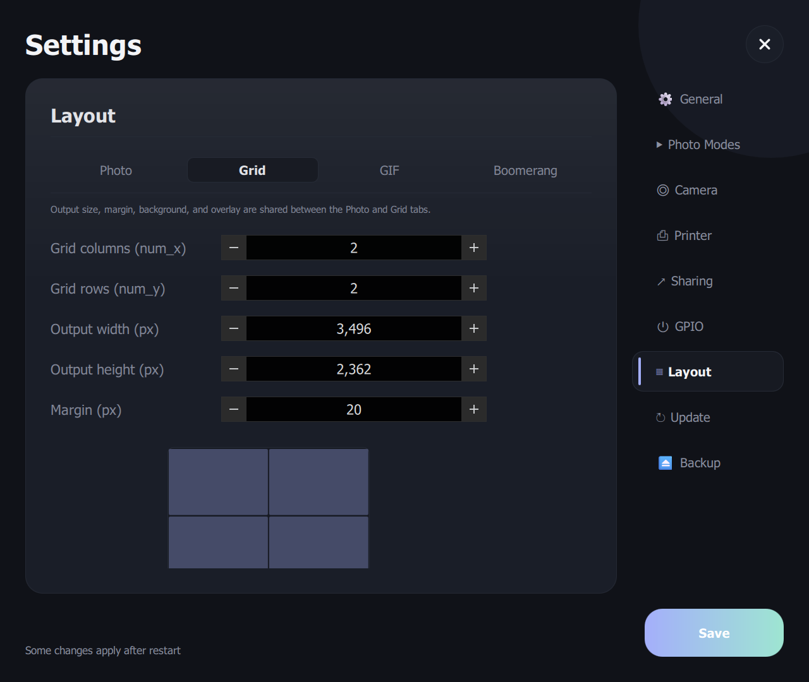
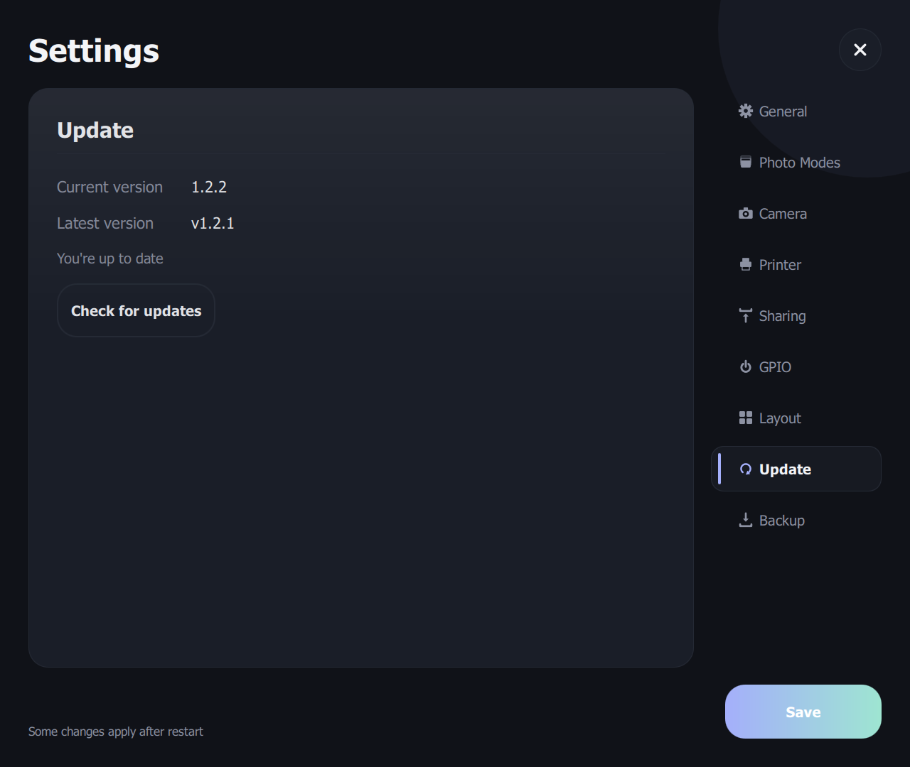

# Photobooth

A modern, native photobooth application for Raspberry Pi 4 (4GB). Built with
Python 3.11+ and PySide6/Qt Quick — no browser, no Electron, GPU-composited
UI that autostarts full-screen on top of the desktop.

<p align="center">
  <center></center>
</p>

<details>
<summary><b>Screenshots of every Settings tab</b></summary>
<br>

| | |
|---|---|
| **General**  | **Photo Modes**  |
| **Camera**  | **Printer**  |
| **Sharing**  | **GPIO**  |
| **Layout**  | **Update**  |

</details>

## Features

- Single / grid / GIF / boomerang capture modes, individually toggled on/off
  from Settings
- Camera backends: Canon DSLR (gphoto2), Raspberry Pi Camera Module
  (picamera2), USB webcam (OpenCV), and a dummy backend for development
- Live preview during countdown, animated on-screen countdown ring, with a
  separately configurable delay between shots in multi-shot sessions
- Filters (B&W, sepia, vintage, vivid) and green-screen chroma key
- Configurable m×n grid layout with a live preview, custom margins, and
  custom background/overlay/logo slots
- Printing via CUPS (Canon SELPHY CP1300/CP1500 out of the box), with a PDF
  debug fallback
- Email, WebDAV upload, and USB export sharing
- GPIO support for a physical trigger button, exit button, lamp, and RGB
  LED ring
- In-app, PIN-gated settings covering every option above, plus an
  on-screen exit-with-confirmation button
- English/German UI
- Idle-screen slideshow of recent shots, SQLite-indexed

## Requirements

- Python 3.11 or newer
- [uv](https://docs.astral.sh/uv/) for dependency management (installed
  below if you don't have it)

## Scope: this only ever *runs* on a Raspberry Pi

The app is built for one real target: a Raspberry Pi 4 running as a kiosk
(see [Raspberry Pi deployment](#raspberry-pi-deployment) below). Windows is
used only for editing and debugging the UI/code — it is **not** a
functional test environment. Camera (`gphoto2`), printer (`pycups`), and
GPIO (`gpiozero`/`lgpio`) integrations are Linux-only and are automatically
skipped by `uv sync` on Windows (see the `sys_platform == 'linux'` markers
in `pyproject.toml`), so on Windows the app always runs against the dummy
camera backend and a PDF "printer" — enough to work on layout, flow, and
Settings screens, but never a substitute for testing on the actual Pi with
the real hardware.

### Windows (UI/code editing only)

1. Install Python 3.11+ from [python.org](https://www.python.org/downloads/)
   or the Microsoft Store, making sure "Add python.exe to PATH" is checked.
2. Install `uv` (PowerShell):
   ```powershell
   powershell -ExecutionPolicy ByPass -c "irm https://astral.sh/uv/install.ps1 | iex"
   ```
   Close and reopen your terminal afterwards so `uv` is on `PATH`.
3. Clone the repo and set up the environment:
   ```powershell
   git clone https://github.com/Tunefish92/photobooth.git
   cd photobooth
   uv sync --group dev
   ```
4. Run the app:
   ```powershell
   uv run photobooth
   ```
   or double-click [`scripts/run-windows.bat`](scripts/run-windows.bat), which
   does the same thing regardless of your current directory and pauses on
   an error so the window doesn't just vanish. It launches windowed by
   default on non-Linux platforms. To force a
   specific window size or fullscreen for a quick look at the kiosk layout,
   edit `app.fullscreen`/`app.width`/`app.height` in the user config (see
   [Configuration](#configuration)) — no need to touch the defaults file.
   Remember this is still running against the dummy camera/PDF printer;
   it's for checking the UI renders and behaves correctly, not for
   validating capture/print/GPIO behavior.
5. Run the tests:
   ```powershell
   uv run pytest
   ```

## Raspberry Pi deployment

This is the only environment the app is actually meant to run in. Target:
Raspberry Pi 4 (4GB), 64-bit Raspberry Pi OS **Desktop** (not Lite) — the
app runs as a normal fullscreen window under the desktop's own Wayland
compositor (`labwc`), autostarted once the desktop session comes up. This
sidesteps the DRM/KMS master/permission issues a direct-framebuffer
(`eglfs`) kiosk would otherwise fight with when launched outside of an
interactive login session.

1. Flash Raspberry Pi OS (64-bit, **Desktop**) with Raspberry Pi Imager,
   boot the Pi, and make sure it has network access.
2. Clone the repo onto the Pi:
   ```bash
   git clone https://github.com/Tunefish92/photobooth.git
   cd photobooth
   ```
3. Run the provisioning script as root:
   ```bash
   sudo scripts/install.sh
   ```
   This installs every system package the app needs — camera stack
   (`picamera2`/`libcamera`), `gphoto2`, CUPS plus the `gutenprint` driver
   and driverless IPP-over-USB support (for the Canon SELPHY CP1300/
   CP1500), the Qt/EGL/Wayland runtime libraries PySide6 needs at runtime,
   and the build toolchain `gphoto2`/`pycups`/`lgpio` need to compile their
   C extensions — creates a `.venv` with access to the apt-installed
   `picamera2`, syncs the pinned dependencies into it via `uv sync`
   (respecting `uv.lock`), installs a desktop autostart entry plus a
   Desktop shortcut (see [`scripts/photobooth.desktop`](scripts/photobooth.desktop)
   and [`scripts/run-kiosk.sh`](scripts/run-kiosk.sh)), and sets the Pi to
   boot straight to the desktop with auto-login.
4. The script prints two manual steps at the end: registering the SELPHY
   printer's exact USB device URI in CUPS (varies per unit — the script
   walks through both the driverless and gutenprint-driver paths), and
   rebooting to pick everything up. Both are one-time, hardware-specific
   steps that can't be scripted generically.
5. Check on it — either double-click the **Photobooth** icon on the
   desktop, or from a terminal in the desktop session (not over SSH, it
   needs the desktop's Wayland display):
   ```bash
   scripts/run-kiosk.sh
   ```

Re-running `sudo scripts/install.sh` after a `git pull` is safe — it's
idempotent (re-syncs dependencies, re-installs the autostart entry) and
won't duplicate anything.

## Configuration

Defaults live in `src/photobooth/config/defaults.toml`. User overrides and
photo/session data are stored under the platform's standard app-data
directory (see `src/photobooth/paths.py` — `%APPDATA%\photobooth` on
Windows, `~/.local/share/photobooth` on Linux by default, both overridable
via the usual `XDG_*`/`APPDATA` environment variables) and are also
editable live from the in-app Settings screen (PIN-protected, default PIN
`1234` — change it on first setup). Settings marked "restart required" in
the UI (camera backend, GPIO, fullscreen/window size) need the app
restarted to take effect; everything else applies immediately on Save.

## Project layout

```
src/photobooth/
├── ui/              QML front end (screens, reusable components, Theme)
├── bridge/          Python <-> QML glue (the AppController exposed to QML)
├── core/            State machine + capture session, deliberately Qt-free
├── camera/          Camera backends (gphoto2, picamera2, opencv, dummy)
├── printing/        Printer backends (CUPS, PDF fallback)
├── sharing/         Email, WebDAV, USB export
├── imaging/         Grid compositing, filters, chroma key, GIF/boomerang
├── hardware/        GPIO controller
├── storage/         SQLite index + on-disk photo storage
├── i18n/             Translator + en/de translation catalogs
└── config/          Settings model + defaults.toml
tests/               pytest suite (state machine, compositor, config,
                     translations, and headless QML smoke tests)
scripts/             install.sh + the desktop autostart entry it installs
```

## Running the tests

```bash
uv run pytest
```

The suite is pure `pytest` (see `tests/`) and includes headless QML smoke
tests that load the real UI via Qt's `offscreen` platform plugin — no
display or hardware required, works the same on Windows and Linux.
